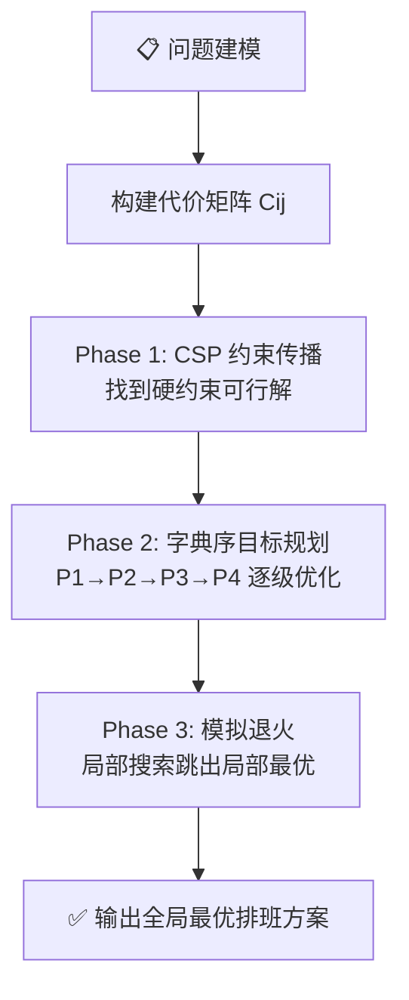

# CDU 就业指导中心排班系统

> 成都大学就业指导中心值班排班自动化工具  
> 版本：`2.0.0`（运筹学目标规划重构）

---

## 📖 项目简介

本系统是为**成都大学就业指导中心**设计的智能排班管理工具，基于 Python 开发，主要功能包括：

- 🗓️ **自动排班** — 根据学生空闲时间、部门、年级等约束自动生成值班表
- ☁️ **云端同步** — 通过腾讯云 COS 实现排班数据的云端备份与多端同步
- 📋 **反馈处理** — 自动化处理学生反馈（请假/调班等），更新数据库
- 📊 **数据导出** — 导出 `time_list.json` 供小程序端使用
- 🧪 **版本对比** — 支持排班方案多版本对比

---

## 🏗️ 项目结构

```
cdujyzdzxdata/
├── main_controller.py              # 🎯 主控制器（交互式菜单入口）
├── print_schedule.py               # 🖨️ 排班结果打印/示例生成
├── test.py / test1.py              # 🧪 排班功能测试
├── test_scheduling.py              # 🧪 排班算法单元测试
├── users_data.json                 # 👥 用户数据（预留）
├── version.txt                     # 📌 版本号
│
├── scheduling_algorithm/           # 🧠 排班算法核心
│   ├── scheduling_configuration_allocate.py   # 资源分配引擎（含OR入口）
│   ├── scheduling_configuration_file_module.py # 配置文件管理
│   ├── sheduling_tools_module.py              # 评分/奖惩计算
│   └── operations_research_scheduler.py       # 🆕 运筹学目标规划求解器
│
├── database/                       # 🗄️ 数据库层
│   ├── code/
│   │   ├── basecmd.py              # 课表解析 & 数据库 CRUD
│   │   └── new_database.py         # 数据库表结构创建
│   └── data/
│       └── version.json            # 数据版本记录
│
├── cloud/                          # ☁️ 云服务
│   └── cloud_tools.py              # 腾讯云 COS 备份/同步管理
│
├── automation_tools/               # 🤖 自动化工具
│   └── automation_tools.py         # 反馈处理 & time_list 导出
│
├── configuration_file/             # ⚙️ 配置文件
│   ├── scheduling_configuration_file.json        # 排班规则配置
│   └── cloud_configuration_file.json.example     # 云服务配置模板
│
├── manegement_tools/               # 🔧 管理工具（待开发）
├── mini_program_data/              # 📱 小程序数据（运行时生成）
├── feedback/                       # 📝 反馈文件（运行时生成）
└── backup/                         # 💾 本地备份
```

---

## 🚀 快速开始

### 环境要求

| 依赖 | 说明 |
|------|------|
| Python | 3.8+ |
| SQLite3 | 内置，无需安装 |
| pandas | 课表 Excel 解析 |
| cos-python-sdk-v5 | 腾讯云 COS 上传/下载 |

### 安装

```bash
# 克隆仓库
git clone https://github.com/kanekikunn001/cdujyzdzxdata.git
cd cdujyzdzxdata

# 创建虚拟环境
python -m venv venv
venv\Scripts\activate   # Windows
# source venv/bin/activate  # Linux/macOS

# 安装依赖
pip install pandas cos-python-sdk-v5
```

### 配置云服务

```bash
# 复制云服务配置模板
cp configuration_file/cloud_configuration_file.json.example configuration_file/cloud_configuration_file.json

# 编辑文件，填入你的腾讯云 COS 密钥
```

### 运行

```bash
# 启动主控制器（交互式菜单）
python main_controller.py

# 运行测试
python test.py
```

---

## 📋 主控制器菜单

```
🚀 排班系统主控制器
==================================================

  1. 云同步 - 下载最新数据
  2. 云同步 - 上传本地数据
  3. 处理反馈文件
  4. 导出 time_list.json
  5. 创建反馈统计表
  6. 版本对比
  0. 退出
```

---

## 🧠 排班算法说明

本系统支持**两种模式**，可通过配置文件 `algorithm` 字段切换：

| 配置值 | 算法 | 特点 |
|--------|------|------|
| `"greedy"` | 贪心打分法（v1） | 逐班次选最高分，简单直接 |
| `"goal_programming"` | 运筹学目标规划（v2，**推荐**） | 全局最优、公平性量化、模拟退火 |

### 🎯 运筹学目标规划（v2.0）

基于运筹学中的**多目标整数规划**理论，将排班建模为数学优化问题：



**目标层级（按优先级从高到低）：**

| 优先级 | 目标 | 数学表达 | 物理意义 |
|--------|------|----------|----------|
| P₁（最高） | 工作量公平 | $\min \sum_i (L_i - \bar{L})^2$ | 每人排班次数方差最小 |
| P₂ | 在一起/分开 | $\min \sum_k \text{penalty}_k$ | 满足配对/互斥约束 |
| P₃ | 部门匹配 | $\max \sum \text{department\_match}$ | 专属班次安排对应部门 |
| P₄ | 早晚班平衡 | $\min \sum_i |M_i - E_i|$ | 每人早晚班次数均衡 |

**代价函数：**
$$C_{ij} = 10 \cdot (L_i - \bar{L})^2 + 50 \cdot t_{ij} + 5 \cdot d_{ij} + 8 \cdot b_{ij}$$

| 分量 | 权重 | 含义 |
|------|------|------|
| $(L_i - \bar{L})^2$ | 10 | 工作负载偏离平均值的平方 |
| $t_{ij}$ | 50 | together/separation 违反惩罚 |
| $d_{ij}$ | 5 | 部门不匹配代价 |
| $b_{ij}$ | 8 | 早晚班不均衡代价 |

### v1 贪心算法（旧版）

排班采用**加分-扣分**制评分模型，为每个候选学生计算综合得分：

**加分项（`calculate_bonus`）**
| 条件 | 加分 |
|------|------|
| 新成员 | +5 |
| 同部门优先 | +5 |
| 指定一同值班 | +50 |

**扣分项（`calculate_penalty`）**
| 条件 | 扣分 | 
|------|------|
| 本周已排班次数 | -1/次 |
| 特殊班次（早/晚） | -次数 |
| 本周已有排班 | -2/次 |
| 指定分开值班 | -50 |

### 约束规则

- `same_department` — 同部门优先安排
- `night_shift` — 是否启用晚班
- `necessary_old_member` — 每个班次最少老成员数
- `only_department` — 特定部门专属时段
- `together` / `separation` — 指定人员同行/分开

---

## 🗄️ 数据库结构

### 空闲时间表

存储每位学生的空闲周信息，列为：

> `学号` | 周一1-2节 | 周一3-4节 | ... | 周五9节

每个时间段记录该学生**空闲的周号列表**。

### 反馈统计表

| 字段 | 说明 |
|------|------|
| 学号 | 学生 ID |
| 反馈备注 | 原始反馈内容 |
| 处理结果 | 处理状态 |
| 审核人员 | 审核者 |
| 上传时间 | 提交时间 |
| 反馈文件名 | 源文件名 |

---

## ⚙️ 排班配置文件

```json
{
    "algorithm": "goal_programming",
    "algorithm_description": "可选: 'greedy' 或 'goal_programming'",
    "week": 1,
    "days": [1, 2, 3, 4, 5],
    "days_order": [1, 2, 3, 4, 5],
    "time_period": [
        {"days": [1,2,3,4], "times": [1,2,3,4,5,6]},
        {"days": [5], "times": [1,2,3]}
    ],
    "people": {
        "type": "for_day",
        "schedules": [
            {"times": [1,2,4,5], "number": 4},
            {"times": 3, "number": 2},
            {"times": 6, "number": 1}
        ]
    },
    "necessary_old_member": 1,
    "same_department": true,
    "night_shift": true
}
```

| 参数 | 说明 |
|------|------|
| `week` | 排班周次 |
| `days` / `days_order` | 排班天及顺序 |
| `time_period` | 每天的时间段配置 |
| `people` | 每班次所需人数 |
| `necessary_old_member` | 每班最少老成员数 |

---

## 📝 数据文件

| 文件 | 说明 |
|------|------|
| `scheduling_data.json` | 排班结果数据 |
| `scheduling_list.json` | 人员排班统计 |
| `time_list.json` | 小程序端时间列表 |
| `version.json` | 数据版本信息 |

---

## ⚠️ 安全提醒

- `cloud_configuration_file.json` 包含腾讯云密钥，**已被 `.gitignore` 排除**，不会提交到 Git
- 若密钥曾暴露在 Git 历史中，请及时在[腾讯云控制台](https://console.cloud.tencent.com/cam/capi)轮换
- 使用时请从模板文件 `cloud_configuration_file.json.example` 复制并填入真实密钥

---

## 📄 License

内部工具，仅供成都大学就业指导中心使用。
